## About Me

-   Professor of Urban Analytics in the [Bartlett Centre for Advanced Spatial Analysis (CASA)](https://www.ucl.ac.uk/bartlett/casa/), University College London
-   Lifetime geographer - although didn't ever really have any plans to be, it just sort of happened!

::: {#centre_text style="text-align: center; font-size: xxx-large"}
[My Geographical history](https://earth.google.com/earth/d/1WL5cJxPVZtq7OIm1eWEb3KVHI8G3Ctiw?usp=sharing){target="_blank"}
:::

## Recent Research Interests

::: columns
::: {.column width="50%"}
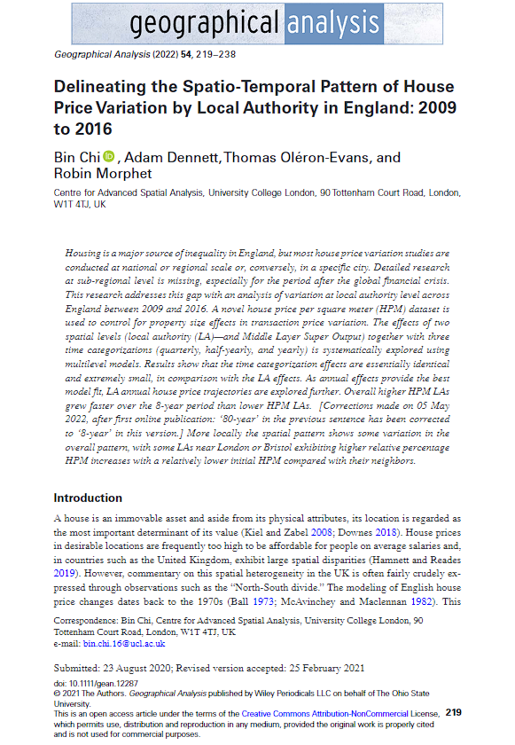
:::

::: {.column width="50%"}
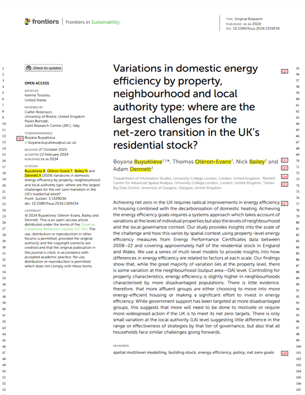
:::
:::

## What am I going to talk about today?

-   A little bit of background on the important (and often overlooked) part that residential buildings play in our journey towards a carbon net-zero country.

-   The leaky homes problem we have in the UK

-   How we can measure leaky homes - Energy Performance Certificates

-   What needs to be done to fix leaky homes and the problems ahead

-   How geography and geographers can help!

-   Some things ***we*** have found through analysing data

-   What ***you*** could try in the classroom and some resources you could use

-   Conclusions and Questions

## UK CO^2^ Emissions

::: columns
::: {.column width="40%"}
-   The UK Government has legally binding targets under the Climate Change Act 2008 to reach 'net zero' carbon emissions by 2050

-   Carbon emissions are produced through demand for energy

    -   **directly** through burning gas, wood, coal, peat, oil for heat/cooking etc.
    -   **indirectly** through burning these things to produce electricity

-   **Residential buildings** currently account for about **13.7%** of the UK's total greenhouse gas emissions - heating, cooling + running applicances

-   While Greenhouse Gas emissions have reduced since 1990, housing is now responsible for a greater proportion of our total emissions than ever before - producing around **56 million tons of CO^2^** per year
:::

::: {.column width="60%"}

::: {.cell}
::: {.cell-output-display}
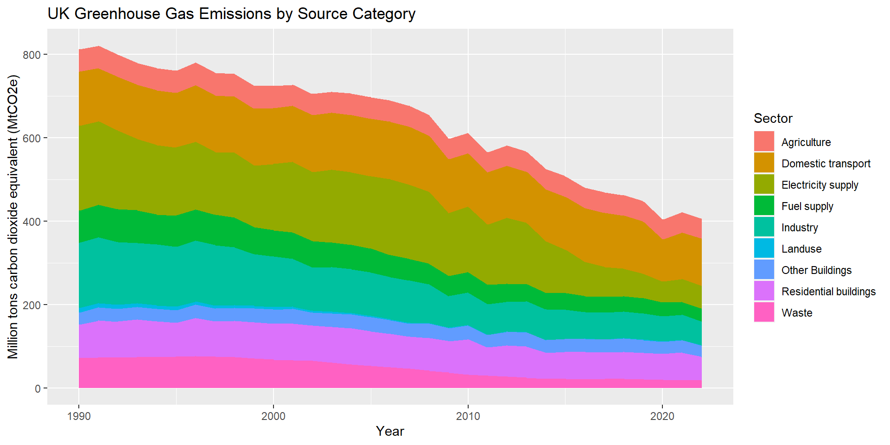{width=960}
:::
:::

:::
:::

## UK Housing and CO^2^ Emissions

::: {.cell}
::: {.cell-output-display}
{width=960}
:::
:::

Source: Eurostat + UK Government

-   Housing in the UK is some of the worst, overall, in Europe for emitting greenhouse gases.

## UK Housing and CO^2^ Emissions

::: {.cell}
::: {.cell-output-display}
{width=960}
:::
:::

Source: Eurostat + UK Government

-   Even after adjusting for population, UK housing stock is responsible for emitting far more CO^2^ than housing in countries with much colder climates like Iceland, Sweden, Norway and Finland

## Leaky Homes

::: columns
::: {.column width="50%"}
-   In 2021, the National Housing Federation reported that a combination of gas central heating and poor insulation meant that as heat easily leaks from many of the UK's homes, it requires even more gas to heat them.

-   The average family or household in England is currently producing more CO^2^ every year by just living in their home than they are by driving their car!

-   Three in every five (60%) homeowners don't think their home energy use has much of an impact on carbon emissions. More than one in four homeowners (28%) have no plans to make "eco-upgrades" to their homes in the next ten years.
:::

::: {.column width="50%"}
[{fig-align="right"}](https://www.theguardian.com/commentisfree/2021/sep/28/britain-homes-energy-crisis-governments-insulation-low-carbon-heating) <https://www.housing.org.uk/news-and-blogs/news/englands-leaky-homes-greater-threat-to-climate-than-cars/>
:::
:::

## How do we know how leaky our home is?

::: columns
::: {.column width="50%"}
-   Energy Performance Certificates were introduced in England and Wales in August 2007
-   A valid certificate (they last for 10 years) is now required for any property sold or rented in the UK
-   Every property gets a current rating - A to G - alongside a potential rating, which relates to what it could achieve with better insulation, double glazing, etc.
-   EPCs are created by surveyors who use something called the 'Standard Assessment Procedure' (SAP) to rate the building. SAP accounts for things like:
    -   Size of building
    -   Age of Building
    -   Building materials used
    -   Glazing
    -   Heating and hot water type
    -   Type of lighting
-   The SAP is an imperfect science and prone to human error, but it's the best method currently available
:::

::: {.column width="50%"}
[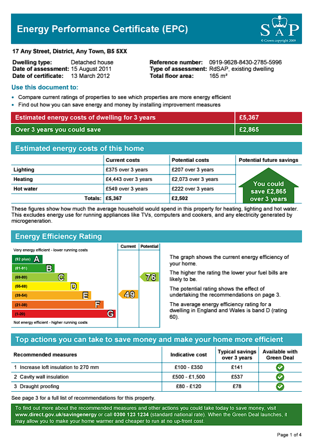{fig-align="center" width="70%"}](https://www.gov.uk/find-energy-certificate)
:::
:::

## What does the government want?

::: columns
::: {.column width="50%"}
-   80% of the homes we will be living in in 2050 are already built now, so we need to focus on improving the housing stock we already have
-   The Clean Growth Strategy was published in October 2017 and includes several targets to improve energy efficiency:
    -   to upgrade all fuel poor homes to Energy Performance Certificate (EPC) **band C** by 2030;
    -   to upgrade as many homes as possible to EPC **band C** by 2035

But is this enough and how are they going to achieve it?
:::

::: {.column width="50%"}
[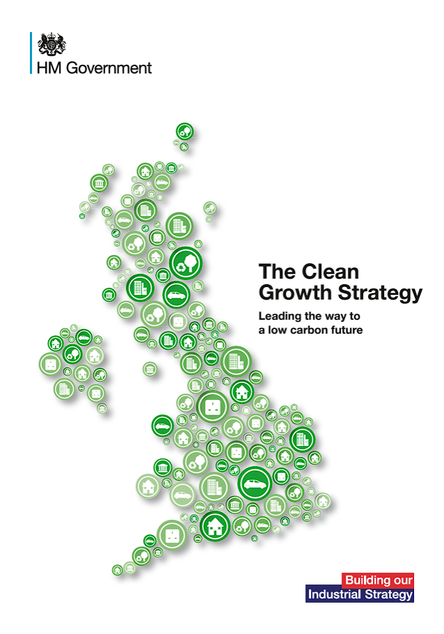{fig-align="center" width="70%"}](https://www.gov.uk/government/publications/clean-growth-strategy)
:::
:::

<https://www.gov.uk/government/publications/clean-growth-strategy>

## Making homes more energy efficient + additional benefits & challenges

::: columns
::: {.column width="50%"}
-   'Retrofitting' -\> process of improving:
    -   insulation
    -   ventilation 
    -   air-tightness
-   upgrading 
    -   heating (e.g. to heat-pumps), 
    -   lighting (LED bulbs) 
    -   installing smart thermostat and heat control devices.
-   Any one could improve energy efficiency, but doing all at once is known as 'Deep Retrofit.'

:::

::: {.column width="50%"}
[{fig-align="center" width="100%"}](https://woodknowledge.wales/gw4-alliance-led-project-to-retrofit-uk-homes/)
:::
:::

## Making homes more energy efficient + additional benefits & challenges

-   Retrofitting has other benefits:
    -   **Health** - The Building Research Establishment [estimates that poor housing costs the NHS £1.4bn per year in additional treatments](https://bregroup.com/news-insights/the-cost-of-poor-housing-to-the-nhs/), with excess cold causing the most problems.
    -   **Jobs** - National retrofit programme could create thousands of jobs, benefiting the wider economy;
    -   **Energy security** - making us less reliant on imported fossil gas for heating
-   But, retrofitting is expensive (up-front cost) - [recent estimates](https://residential.jll.co.uk/insights/research/decarbonising-uk-housing-2024) are that the average cost of retrofitting a property to Grade C or above would cost ***£35,000*** - even basic insulation costs can run into many thousands of pounds.
-   Saving money on heating will eventually make this money back, but it could take many years

[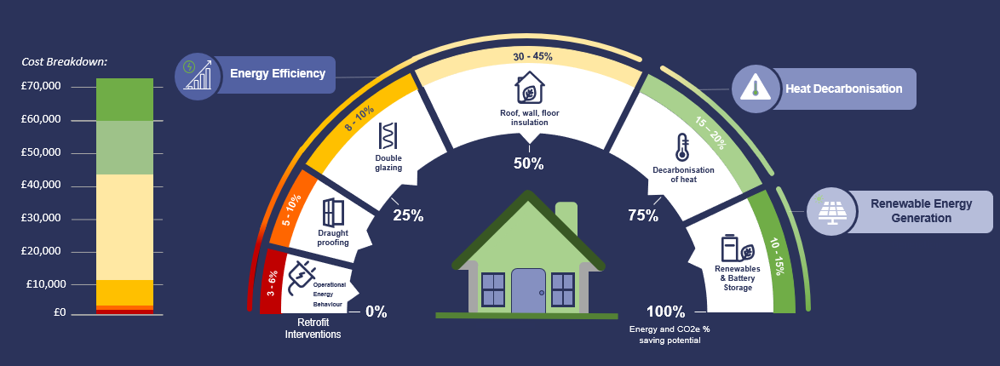{fig-align="center" width="100%"}](https://the3cities.co.uk/retrofit)

## What needs to be done?

::: columns
::: {.column width="50%"}
-   Insulate Britain - pressure group - Estimates that 1.5 homes per minute need to be retrofitted up until 2050 to hit our legally-binding net-zero target - something that we are currently far from achieving.
-   Retrofit is expensive 
-   Route retrofit unclear for many people (where should I start, who can do it for me?)
-   Central government needs to develop proper incentives 
    -   Direct funding (grants) 
    -   or tax incentives 
-   Schemes such as those available in Ireland (where government recommends suppliers, installers etc.) needed to help people get started
-   Insulate Britain highlights that UK government currently doesn't have a long-term strategy or funding mechanism in place to upgrade/retrofit homes to meet our climate commitments - write to your MPs!
:::

::: {.column width="50%"}
[{fig-align="center" width="100%"}](https://insulatebritain.com/)

<https://insulatebritain.com/>
:::
:::

## What role can we as Geographers play in helping the transition?

::: columns
::: {.column width="50%"}
-   More or less energy efficient homes are not spread evenly across the country - some places and some types of neighbourhood are more or less likely to have energy efficient homes

-   If we can understand *where* the problem is most acute and how much we might need to do in different places, we can begin to put pressure on the government or the local countil to make better policy / invest funds in a more targeted way

-   If we can explain what the problem is in our local area, we stand a better chance of trying to solve it

-   We can contact our local councilors and MPs to ask them make improving housing in our area more of a priority
:::

::: {.column width="50%"}
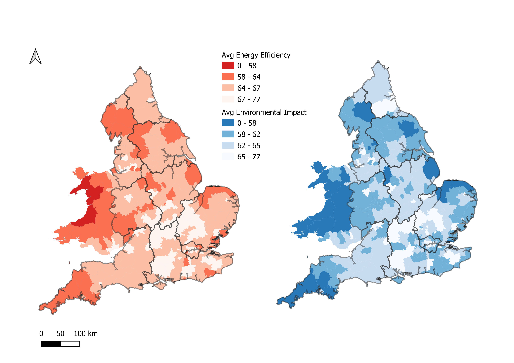{fig-align="center" width="100%"}

Average Energy Efficiency and Environmental Impact by Local Authority - Source, <https://epc.opendatacommunities.org/>
:::
:::

## Analysing Spatial Data on Domestic Energy Performance

::: columns
::: {.column width="50%"}
-   The Department for Levelling Up, Housing and Communities (DLUHC) collects and maintains data on every Energy Performance Certificate issued in England and Wales. The database is available as Open Data for anyone to explore and analyse.

-   The latest edition of the EPC dataset (Version 10) contains some 25 million records (some repeat entries) which equate to about 14 million residential properties in the England and Wales - just over 50% of the 26.7 million that exist.

-   More recent entries to the EPC database feature a Unique Property Reference Number (UPRN) which enables us locate precisely where each property is located
:::

::: {.column width="50%"}
{fig-align="center" width="100%"}
:::
:::

## Some intitial analysis of the EPC dataset

::: columns
::: {.column width="40%"}
-   We analysed 14m properties in the EPC dataset
-   Energy Efficiency is strongly correleated with the age of the property - older properties are on average less energy efficient, more modern properties are more energy efficient
-   Band C (69 and above) is the government target for efficient homes.
    -   If your property was built after 2003, you have a very high probability of being band C or higher
    -   As properties get older the variation in their efficiency gets greater, but the probability of being band C or above gets much lower.
    -   Any property built before World War II has a high probabilty of being below band C
:::

::: {.column width="60%"}
{fig-align="center" width="100%"}
:::
:::

## Some intitial analysis of the EPC dataset

::: columns
::: {.column width="50%"}
-   Tenure: Whether the house is owner-occupied, privately rented or socially rented is also very important - Social rented housing has far better energy efficiency than all other housing tenures
-   Various reasons for this:
    -   social landlords more conscious of the needs of residents, some large retrofit programmes
    -   social housing more likely to be flats
:::

::: {.column width="50%"}
{fig-align="center" width="100%"}
:::
:::

## Some intitial analysis of the EPC dataset

::: columns
::: {.column width="50%"}
-   The type of property - i.e. whether it is a flat, detached, semi-detached or terraced house is important (the fewer outside walls the better!)
-   Older detached housing with more external walls and larger floor areas has the worst energy efficieny - even some modern detached housing has poor energy efficiency (Bottom Right)
-   Terraced flats and masionettes with fewer external walls and smaller floor areas have the best energy efficiency, with even older properties more likely to be rated C or above than some more modern terraced and semi-detached housing
:::

::: {.column width="50%"}
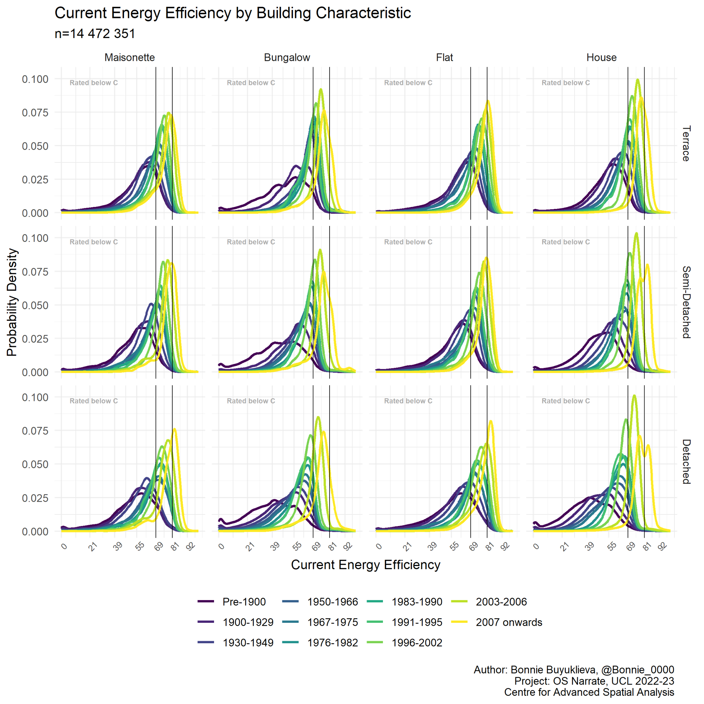{fig-align="center" width="100%"}
:::
:::

## Some intitial analysis of the EPC dataset

-   Depending on which part of the country you are living in, you are more likely to be living in a particular type and size of property
-   If we can account for the type, size, age and other characteristics of a property relative to energy efficiency, we can show where energy efficiency is better or worse than we would expect

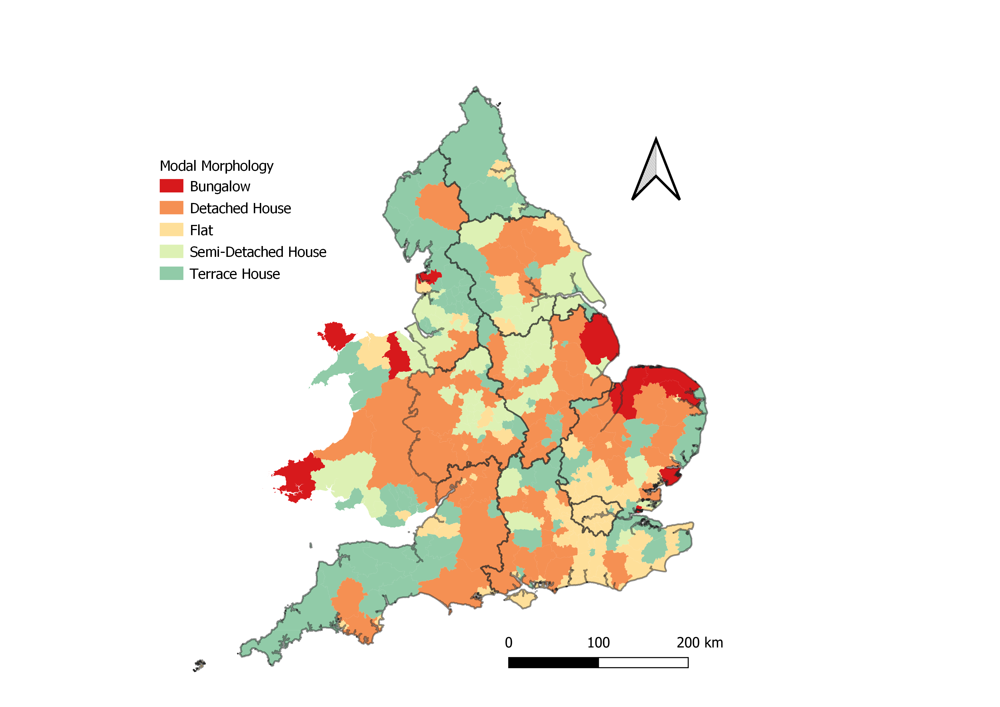{fig-align="left" width="45%"} 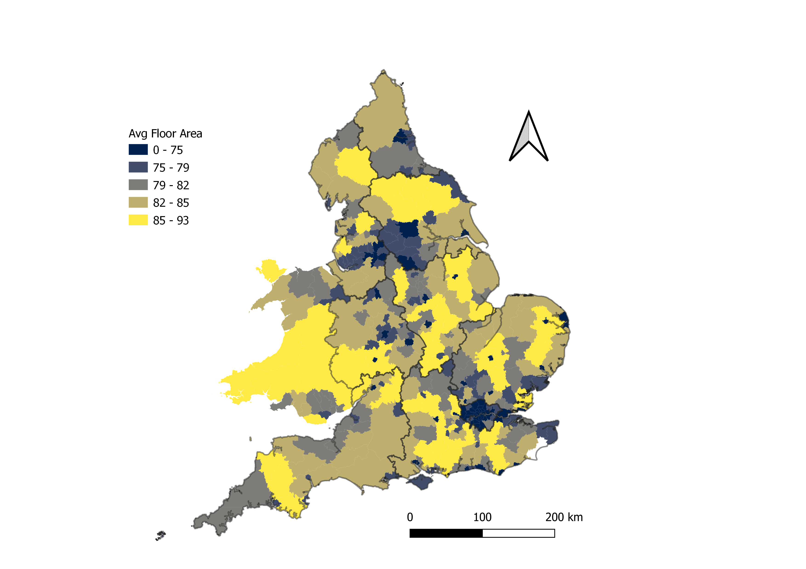{fig-align="right" width="45%"}

## Some intitial analysis of the EPC dataset

::: columns
::: {.column width="50%"}
-   In this piece of analysis we built a statistical model that predicted building energy efficiency as a function of:
    -   age
    -   dwelling type
    -   tenure
    -   floor area
    -   and which Local Authority the property was found in
-   The map on the right shows, after controlling for the variables above, relative to Tower Hamlets (the local authority with the overall best Energy Efficiency in England), how many EPC points better or worse on average properties in each Local Authority are
-   The map on the left shows where real average EPC values are lower/worse (\<1 - red) or higher/better (\>1 - orange to blue) than we might expect, given the housing stock mix.
    -   Properties within boroughs in Central London, in particular, Islington, Hackney and Hammersmith and Fulham perform worse than expected, alongside Harlow in Essex, Eastleigh in Hampshire, Norwich, Lincoln and Sunderland
:::

::: {.column width="50%"}
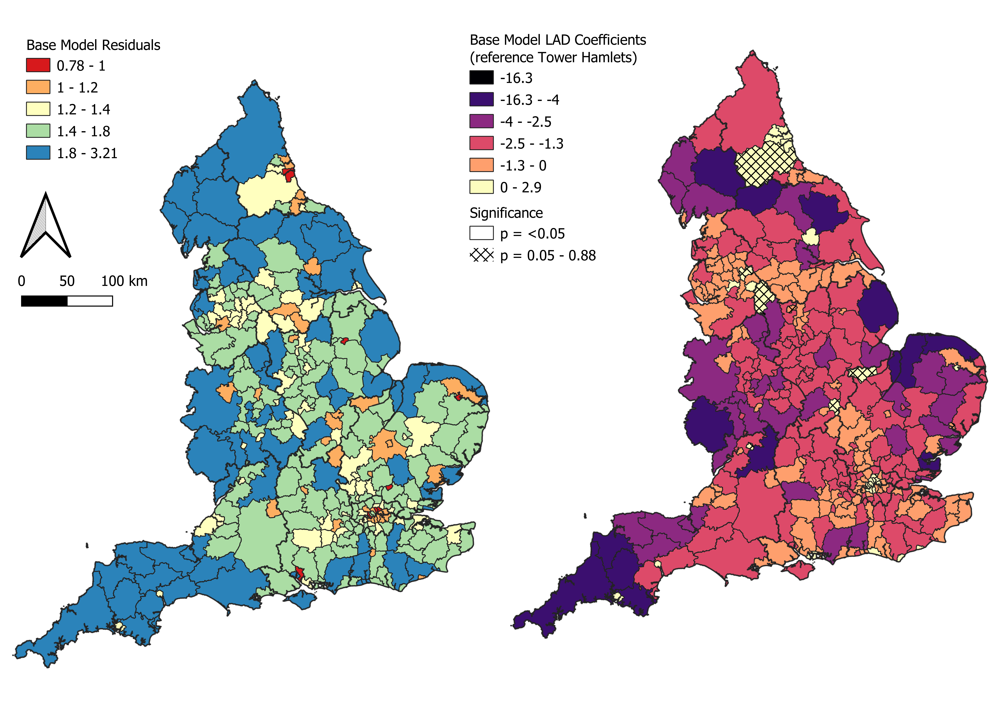{fig-align="right" width="100%"} <https://www.ucl.ac.uk/bartlett/casa/publications/2023/may/casa-working-paper-233>
:::
:::

## How can we investigate this in the classroom?

::: columns
::: {.column width="50%"}
-   Investigate the Geography of Housing and potential energy performance in your local area
    -   Housing from different periods can be dated by looking at the style of the architecture
    -   Historic England have fantastic resources on the types of architectural styles common in different periods in the UK - <https://historicengland.org.uk/services-skills/education/images-by-theme/> - <https://heritagecalling.com/2019/11/15/a-brief-introduction-to-terraced-housing/>
    -   <https://heritagecalling.com/2019/07/29/the-history-of-council-housing/>
-   A field trip out to identify and different types of house and their characteristics (double or single glazing, detached, semi-detached etc.) and create a map of where different periods of house building are in the vicinity
:::

::: {.column width="50%"}
{fig-align="right" width="70%"}<https://files.bregroup.com/bretrust/The-Housing-Stock-of-the-United-Kingdom_Report_BRE-Trust.pdf>
:::
:::

## How can we investigate this in the classroom?

-   How old (and potentially energy inefficient) is the housing in your area?
-   National Libaray of Scotland - and unbelieveable resource for historic maps - e.g. Hassocks, 1909

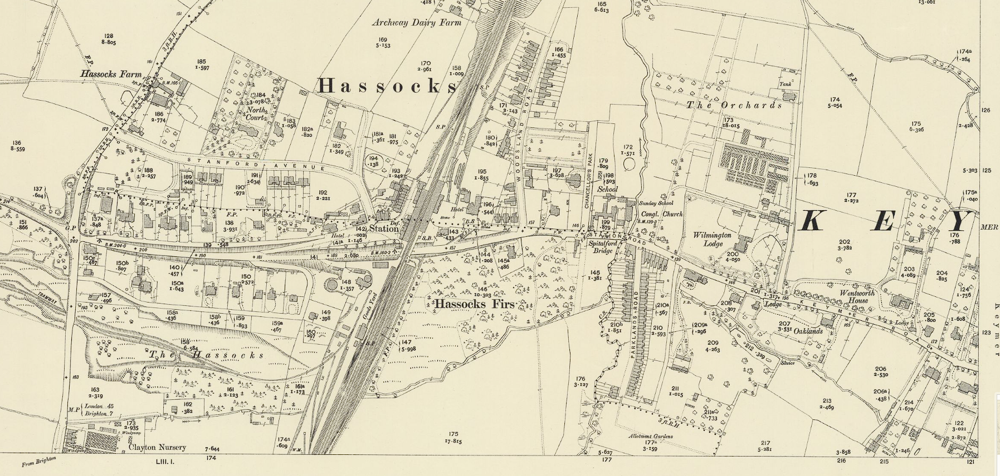{fig-align="centre" width="80%"}

<https://maps.nls.uk/view/103670803>

## How can we investigate this in the classroom?

-   Maps from different periods can give clues as to when some of the older local properties might have been built - Hassocks 1937

{fig-align="centre" width="70%"} 

<https://maps.nls.uk/view/103670800>

## How can we investigate this in the classroom?

We can use Spatial Data Science - or Geographic Information Science (GIS) for those of us old enough to remember what it used to be called!

{fig-align="center" width="100%"}

## How can we investigate this in the classroom?

::: columns
::: {.column width="50%"}
-   This map was created entirely with Open Data using Open Source Software that can be used in Schools

### Data

-   EPC data downloaded directly from the Government EPC API - <https://epc.opendatacommunities.org/docs/api/domestic>
-   Property locations downloaded from the Ordnance Survey's Open Unique Property Reference Number (UPRN) dataset - <https://www.ordnancesurvey.co.uk/products/os-open-uprn>
-   Road, rail, building and surface water data downloaded from Ordnance Survey's free Open ZoomStack dataset - <https://www.ordnancesurvey.co.uk/products/os-open-zoomstack>
:::

::: {.column width="50%"}
{fig-align="center" width="100%"}
:::
:::

## How can we investigate this in the classroom?

::: columns
::: {.column width="50%"}
### Software

-   Map produced using QGIS and the Vector Tiles Reader plugin to allow you to read Open Zoomstack data from the OS server
-   EPC Data downloaded from the EPC Open Data Communities API using R and RStudio and a couple of useful R packages (and ChatGPT which helped me translate the incredibly helpful Python example code on the API website into R).
-   UPRN Data downloaded from the OS Open Data API with the help of the `osdatahub` package for R made by Ordnance Survey
-   EPC and UPRN data joined in R with the help of the `dplyr` package
-   All code for downloading this data or data for other local authorities with some minor tweaks, can be found on github - <https://github.com/adamdennett/EPC_Data_Analysis>
-   A walk-through guide can be found [here](https://adamdennett.github.io/EPC_Analysis_Website/_site/EPCSpatialAnalysis.html)
:::

::: {.column width="50%"}
[{fig-align="center" width="40%"}](https://qgis.org/en/site/index.html)

[{fig-align="center" width="20%"}](https://www.r-project.org/)

[{fig-align="center" width="40%"}](https://posit.co/products/open-source/rstudio/)

[{fig-align="center" width="20%"}](https://dplyr.tidyverse.org/)
:::
:::

## How can we investigate this in the classroom?

New text

