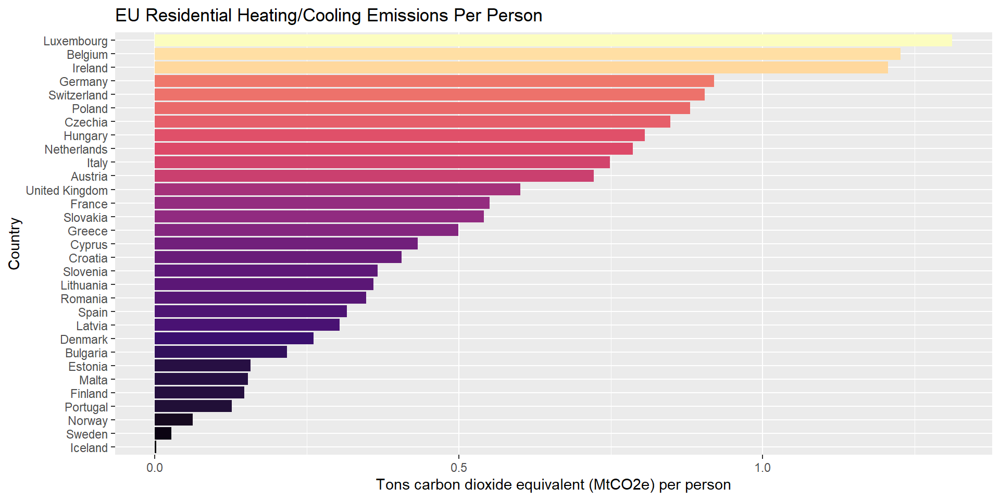
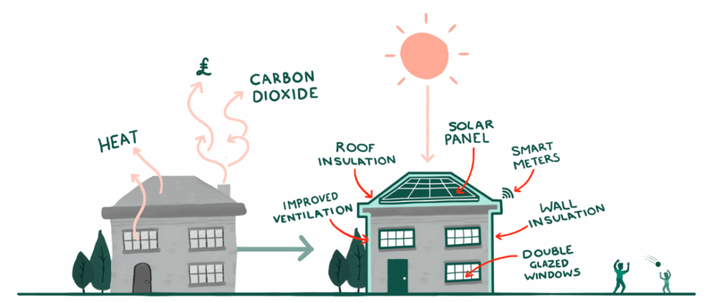
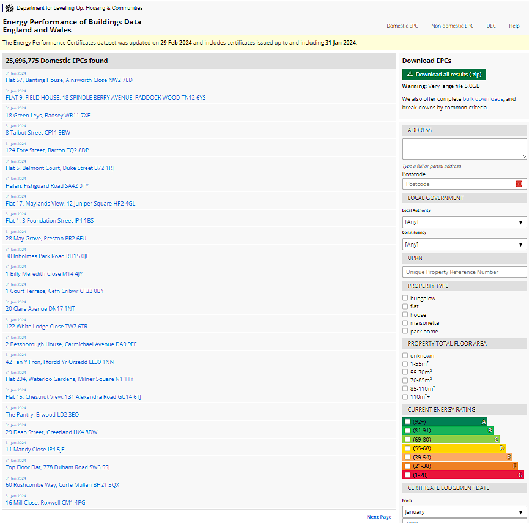
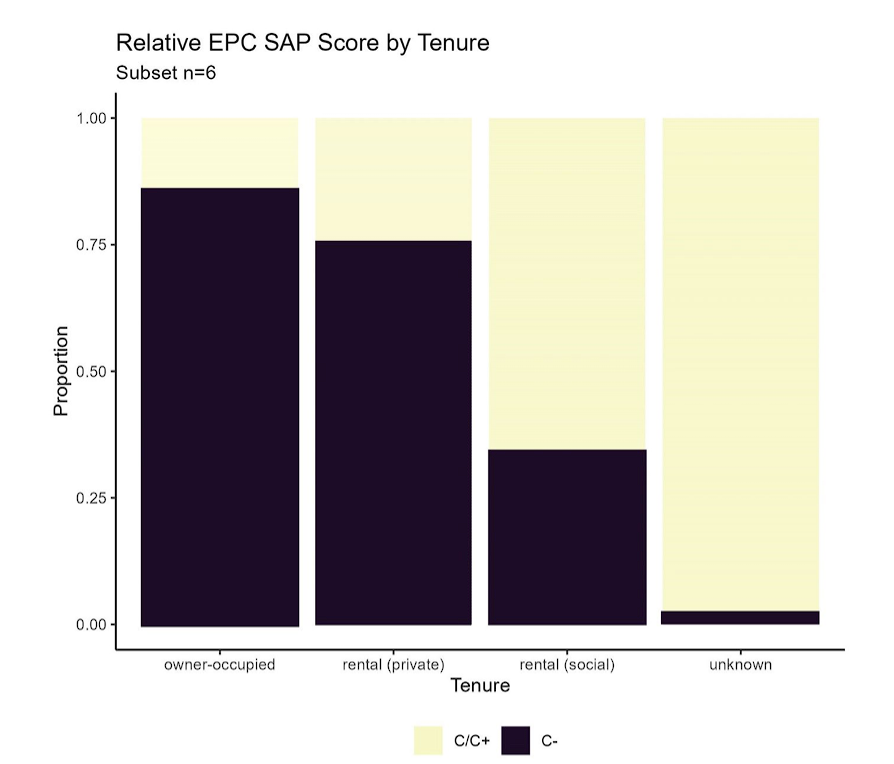

## UK CO^2^ Emissions

::: columns
::: {.column width="40%"}
-   The UK Government has legally binding targets under the Climate Change Act 2008 to reach 'net zero' carbon emissions by 2050

-   Carbon emissions are produced through demand for energy

    -   either directly through burning gas, wood, coal, peat, oil for heat/cooking etc.
    -   or indirectly through buring these things to produce electricity used in homes

-   Heating (and, increasingly, cooling) + running applicances in residential buildings currently accounts for about 13.7% of the UK's total greenhouse gas emissions

-   While Greenhouse Gas emissions have reduced since 1990, housing is now responsible for a greater proportion of our total emissions than ever before - producing around 56 million tons of CO^2^ per year
:::

::: {.column width="60%"}

::: {.cell}
::: {.cell-output-display}
{width=960}
:::
:::

:::
:::

## UK Housing and CO^2^ Emissions

::: {.cell}
::: {.cell-output-display}
{width=960}
:::
:::

Source: Eurostat + UK Government

-   Housing in the UK is some of the worst, overall, in Europe for emitting greenhouse gases.

## UK Housing and CO^2^ Emissions

::: {.cell}
::: {.cell-output-display}
{width=960}
:::
:::

Source: Eurostat + UK Government

-   Even after adjusting for population, UK housing stock is responsible for emitting far more CO^2^ than housing in countries with much colder climates like Iceland, Sweden, Norway and Finland

## Leaky Homes

::: columns
::: {.column width="50%"}
-   In 2021, the National Housing Federation reported that a combination of gas central heating and poor insulation meant that as heat easily leaks from many of the UK's homes, it requires even more gas to heat them.

-   The average family or household in England is currently producing more CO^2^ every year by just living in their home than they are by driving their car!

-   Three in every five (60%) homeowners don't think their home energy use has much of an impact on carbon emissions. More than one in four homeowners (28%) have no plans to make "eco-upgrades" to their homes in the next ten years.
:::

::: {.column width="50%"}
[{fig-align="right"}](https://www.theguardian.com/commentisfree/2021/sep/28/britain-homes-energy-crisis-governments-insulation-low-carbon-heating) <https://www.housing.org.uk/news-and-blogs/news/englands-leaky-homes-greater-threat-to-climate-than-cars/>
:::
:::

## How do we know how leaky our home is?

::: columns
::: {.column width="50%"}
-   Energy Performance Certificates were introduced in England and Wales in August 2007
-   A valid certificate (they last for 10 years) is now required for any property sold or rented in the UK
-   Every property gets a current rating - A to G - alongside a potential rating, which relates to what it could achieve with better insulation, double glazing, etc.
-   EPCs are created by surveyors who use something called the 'Standard Assessment Procedure' (SAP) to rate the building. SAP accounts for things like:
    -   Size of building
    -   Age of Building
    -   Building materials used
    -   Glazing
    -   Heating and hot water type
    -   Type of lighting
-   The SAP is an imperfect science and prone to human error, but it's the best method currently available
:::

::: {.column width="50%"}
[{fig-align="center" width="70%"}](https://www.gov.uk/find-energy-certificate)
:::
:::

## What does the government want?

::: columns
::: {.column width="50%"}
-   80% of the homes we will be living in in 2050 are already built now, so we need to focus on improving the housing stock we already have
-   The Clean Growth Strategy was published in October 2017 and includes several targets to improve energy efficiency:
    -   to upgrade all fuel poor homes to Energy Performance Certificate (EPC) band C by 2030;
    -   to upgrade as many homes as possible to EPC band C by 2035

But is this enough and how are they going to achieve it?
:::

::: {.column width="50%"}
[{fig-align="center" width="70%"}](https://www.gov.uk/government/publications/clean-growth-strategy)
:::
:::

<https://www.gov.uk/government/publications/clean-growth-strategy>

## How do we make our homes more energy efficient and are there any other benefits or drawbacks?

::: columns
::: {.column width="50%"}
-   'Retrofitting' homes is the process of improving insulation, ventilation and air-tightness alongside upgrading heating (e.g. to heat-pumps), lighting and installing smart control devices. Doing all of this at once is known as 'Deep Retrofit.'
-   Retrofitting also has other benefits - for example, for health. The Building Research Establishment [estimates that poor housing costs the NHS £1.4bn per year in additional treatments](https://bregroup.com/news-insights/the-cost-of-poor-housing-to-the-nhs/), with excess cold causing the most problems.
-   A mass programme of retrofitting could also create thousands of jobs, benefiting the wider economy; and help improve our energy security, making us less reliant on imported fossil gas for heating
-   But, retrofitting is expensive (up-front cost) - [recent estimates](https://residential.jll.co.uk/insights/research/decarbonising-uk-housing-2024) are that the average cost of retrofitting a property to Grade C or above would cost ***£35,000*** - even basic insulation costs can run into many thousands of pounds.
-   Saving money on heating will eventually make this money back, but it could take many years
:::

::: {.column width="50%"}
[{fig-align="center" width="100%"}](https://woodknowledge.wales/gw4-alliance-led-project-to-retrofit-uk-homes/)
:::
:::

## What needs to be done?

::: columns
::: {.column width="50%"}
-   With the cost of retrofit so expensive - and the route to doing it unclear for many people - proper incentives such as funding or tax incentives from central government alongside schemes to help home-owners need devising
-   The Insulate Britain pressure group highlights that UK government doesn't have a long-term strategy or funding mechanism to upgrade/retrofit homes to meet our climate commitments
-   Estimates that 1.5 homes per minute need to be retrofitted up until 2050 to hit our legally-binding net-zero target - something that we are currently far from achieving.
:::

::: {.column width="50%"}
[{fig-align="center" width="100%"}](https://insulatebritain.com/)

<https://insulatebritain.com/>
:::
:::

## What role can we as Geographers play in helping the transition?

::: columns
::: {.column width="50%"}
-   More or less energy efficient homes are not spread evenly across the country - some places and some types of neighbourhood are more or less likely to have energy efficient homes

-   If we can understand *where* the problem is most acute and how much we might need to do in different places, we can begin to put pressure on the government or the local countil to make better policy / invest funds in a more targeted way

-   If we can explain what the problem is in our local area, we stand a better chance of trying to solve it
:::

::: {.column width="50%"}
{fig-align="center" width="100%"}

Average Energy Efficiency and Environmental Impact by Local Authority - Source, <https://epc.opendatacommunities.org/>
:::
:::

## Analysing Spatial Data on Domestic Energy Performance

::: columns
::: {.column width="50%"}

-   The Department for Levelling Up, Housing and Communities (DLUHC) collects and maintains data on every Energy Performance Certificate issued in England and Wales. The database is available as Open Data for anyone to explore and analyse. 

-   The latest edition of the EPC dataset (Version 10) contains some 25 million records (some repeat entries) which equate to about 14 million residential properties in the England and Wales - just over 50% of the 26.7 million that exist. 

-   More recent entries to the EPC database feature a Unique Property Reference Number (UPRN) which enables us locate precisely where each property is located

:::

::: {.column width="50%"}

{fig-align="center" width="100%"}

:::
:::

## What we found

::: columns
::: {.column width="30%"}

-   Energy Efficiency is strongly correleated with the age of the property - older properties being much less energy efficient, more modern properties being far more energy efficient

:::

::: {.column width="70%"}

{fig-align="center" width="100%"}

:::
:::

## What we found

::: columns
::: {.column width="50%"}

-   The type of property - i.e. whether it is a flat, detached, semi-detached or terraced house is important (the fewer outside walls the better!)
-   Tenure: Whether the house is owner-occupied, privately rented or socially rented is also very important 

:::

::: {.column width="50%"}

{fig-align="center" width="100%"}

:::
:::

## How can we investigate this in the classroom?

::: columns
::: {.column width="50%"}

:::

::: {.column width="50%"}

:::
:::

